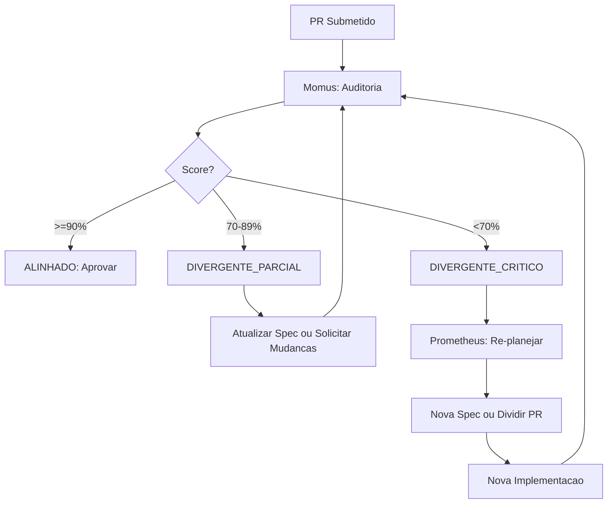

# Auditoria Spec <-> Codigo - Alinhamento no Ciclo SDD

> Este documento define o processo de auditoria para garantir que a spec (issue) e o codigo (PR diff) permanecam alinhados durante todo o ciclo de Spec-Driven Development.

## Objetivo

Garantir que a spec (GitHub Issue) e o codigo (Pull Request diff) permanecam alinhados ao longo do ciclo de vida do SDD, evitando:

- Requisitos implementados parcialmente
- Codigo que nao corresponde a nenhum requisito documentado
- Scope creep silencioso
- Divergencia entre documentacao e realidade

**Principio fundamental:** A spec e a fonte da verdade. Se o codigo diverge, a spec deve ser atualizada ou o codigo deve ser corrigido.

---

## Quando Executar

| Momento                  | Gatilho                                           | Responsavel |
| ------------------------ | ------------------------------------------------- | ----------- |
| **Pre-merge**            | Antes de aprovar qualquer PR                      | Revisor     |
| **Post-implementacao**   | Ao finalizar implementacao de uma task            | Executor    |
| **Quality Gate**         | Durante o Passo 1.6 do GERENCIADOR.MD             | Agente Momus|
| **Re-planejamento**      | Quando escopo muda significativamente             | Agente Prometheus |
| **Hotfix**               | Apos correcao urgente em producao                 | Executor    |

---

## Processo de Auditoria

### Passo 1: Extrair Requisitos da Spec

Da issue (spec), extrair:

```markdown
## Requisitos Extraidos

### Objetivos (da secao OBJETIVOS)
- [ ] Objetivo 1: {descricao}
- [ ] Objetivo 2: {descricao}
- [ ] Objetivo 3: {descricao}

### Arquivos Esperados (da secao POSSIVEIS ARQUIVOS AFETADOS)
- `src/caminho/arquivo1.ts` - {acao: criar|alterar|remover}
- `src/caminho/arquivo2.ts` - {acao: criar|alterar|remover}

### Criterios de Aceite (da secao TESTES)
- [ ] Criterio 1
- [ ] Criterio 2
- [ ] Criterio 3

### Entregaveis (da secao ENTREGAVEL EXATO)
- Type: {interface/tipo}
- Composable: {use-nome}
- Componente: {NomeComponent.vue}
```

### Passo 2: Mapear Requisitos para Arquivos Modificados

Para cada arquivo modificado no diff do PR:

```markdown
## Mapeamento Codigo <-> Requisitos

| Arquivo                    | Tipo Alteracao | Requisito Correspondente        | Status      |
| -------------------------- | -------------- | ------------------------------- | ----------- |
| `src/stores/useExample.ts` | alterado       | Objetivo 1: Implementar store   | COBERTO     |
| `src/views/Example.vue`    | alterado       | Objetivo 2: Criar view          | COBERTO     |
| `src/types/example.ts`     | criado         | Entregavel: Type Example        | COBERTO     |
| `src/utils/helper.ts`      | alterado       | (nenhum requisito)              | FORA_ESCOPO |
```

### Passo 3: Verificar Cobertura

Para cada requisito da spec, verificar se existe codigo correspondente:

```markdown
## Verificacao de Cobertura

### Requisitos Cobertos
- [x] Objetivo 1: Implementar store -> `src/stores/useExample.ts`
- [x] Objetivo 2: Criar view -> `src/views/Example.vue`

### Requisitos NAO Cobertos
- [ ] Objetivo 3: Adicionar testes -> **AUSENTE no diff**
- [ ] Criterio 1: Validacao de formulario -> **AUSENTE no diff**

### Codigo sem Requisito (Escopo Inverso)
- `src/utils/helper.ts` (linhas 10-25) -> Adicionado mas nao especificado
- `src/styles/extra.css` -> Criado mas nao mapeado na spec
```

### Passo 4: Detectar Divergencia

Classificar cada divergencia encontrada:

| Tipo Divergencia            | Exemplo                                      | Severidade |
| --------------------------- | -------------------------------------------- | ---------- |
| **Requisito nao implementado** | Objetivo na spec sem codigo correspondente | ALTA       |
| **Codigo fora do escopo**      | Arquivo modificado sem requisito associado| MEDIA      |
| **Implementacao parcial**      | Requisito implementado pela metade        | ALTA       |
| **Comportamento diferente**    | Spec diz X, codigo faz Y                  | CRITICA    |
| **Refactor nao documentado**   | Mudanca estrutural sem atualizar spec     | MEDIA      |

### Passo 5: Gerar Relatorio

```markdown
# Relatorio de Auditoria Spec <-> Codigo

**Issue:** #123
**PR:** #456
**Data:** YYYY-MM-DD
**Auditor:** {nome/agente}

## Resumo

| Metrica                    | Valor |
| -------------------------- | ----- |
| Requisitos totais          | 5     |
| Requisitos cobertos        | 3     |
| Requisitos ausentes        | 1     |
| Codigo fora do escopo      | 2     |
| Status de Alinhamento      | DIVERGENTE_PARCIAL |

## Detalhamento

### Requisitos Cobertos (3/5)
1. [x] Objetivo 1: Implementar store -> `src/stores/useExample.ts`
2. [x] Objetivo 2: Criar view -> `src/views/Example.vue`
3. [x] Entregavel: Type Example -> `src/types/example.ts`

### Requisitos NAO Cobertos (1/5)
1. [ ] Objetivo 3: Adicionar testes unitarios
   - **Acao sugerida:** Implementar testes antes do merge
   - **OU:** Atualizar spec removendo este objetivo se nao for mais necessario

### Codigo Fora do Escopo (2 arquivos)
1. `src/utils/helper.ts` (linhas 10-25)
   - **Funcao adicionada:** `formatDate()`
   - **Acao sugerida:** Adicionar requisito na spec OU remover do PR

2. `src/styles/extra.css`
   - **Estilos adicionados:** 50 linhas
   - **Acao sugerida:** Documentar na spec ou mover para PR separado

## Recomendacao

- [ ] **BLOQUEAR merge** ate resolver divergencias
- [ ] **ATUALIZAR spec** para refletir escopo real
- [ ] **SOLICITAR mudANCAS** no PR para alinhar com spec
```

---

## Criterios de Alinhamento

### Status de Alinhamento

| Status                 | Criterio                                          | Acao                       |
| ---------------------- | ------------------------------------------------- | -------------------------- |
| **ALINHADO**           | 100% dos requisitos cobertos, 0% fora do escopo   | Prosseguir para merge      |
| **DIVERGENTE_PARCIAL** | Requisitos faltando OU codigo fora do escopo      | Atualizar spec ou PR       |
| **DIVERGENTE_CRITICO** | Escopo mudou significativamente, >30% divergencia | Bloquear, reavaliar        |

### Calculo do Score de Alinhamento

```typescript
interface AlignmentScore {
  requisitosTotais: number
  requisitosCobertos: number
  arquivosModificados: number
  arquivosMapeados: number
}

function calcularScore(score: AlignmentScore): number {
  const coberturaRequisitos = score.requisitosCobertos / score.requisitosTotais
  const coberturaCodigo = score.arquivosMapeados / score.arquivosModificados
  return (coberturaRequisitos + coberturaCodigo) / 2 * 100
}

// Interpretacao:
// 90-100%: ALINHADO
// 70-89%:  DIVERGENTE_PARCIAL
// <70%:    DIVERGENTE_CRITICO
```

---

## Acoes por Status

### ALINHADO (90-100%)

```markdown
## Acao: Prosseguir para Merge

1. Validar code review (PULL_REQUEST_REVIEW.md)
2. Verificar CI/CD passando
3. Aprovar PR
4. Comentar: "Auditoria Spec <-> Codigo: ALINHADO (95%)"
```

### DIVERGENTE_PARCIAL (70-89%)

```markdown
## Acao: Atualizar Spec ou Solicitar Mudancas

### Opcao A: Atualizar Spec (se escopo mudou legitimamente)
1. Editar issue #123
2. Adicionar novos requisitos descobertos
3. Remover requisitos que nao serao implementados
4. Comentar no PR: "Spec atualizada para refletir escopo real"

### Opcao B: Solicitar Mudancas (se codigo divergiu sem justificativa)
1. Comentar no PR com itens faltantes
2. Solicitar implementacao dos requisitos ausentes
3. Solicitar remocao ou documentacao do codigo fora do escopo
4. Aguardar nova versao do PR
```

### DIVERGENTE_CRITICO (<70%)

```markdown
## Acao: Bloquear e Reavaliar

1. Comentar no PR: "AUDITORIA FALHOU: DIVERGENCIA CRITICA"
2. Solicitar reuniao com stakeholders
3. Opcoes:
   a. Re-planejar spec (Agente Prometheus)
   b. Dividir PR em partes menores
   c. Fechar PR e recomecar com nova spec
4. NAO permitir merge ate resolucao
```

---

## Formato de Relatorio

### Template de Relatorio de Auditoria

```markdown
# Auditoria Spec <-> Codigo

## Metadados

| Campo          | Valor                        |
| -------------- | ---------------------------- |
| Issue          | #123                         |
| PR             | #456                         |
| Branch         | feature/example              |
| Auditor        | Momus (Quality Gate)         |
| Data           | YYYY-MM-DD HH:MM:SS          |
| Duracao        | X minutos                    |

## Score de Alinhamento

| Metrica                      | Valor |
| ---------------------------- | ----- |
| Requisitos totais            | N     |
| Requisitos cobertos          | N     |
| Requisitos ausentes          | N     |
| Arquivos modificados         | N     |
| Arquivos mapeados            | N     |
| Arquivos fora do escopo      | N     |
| **SCORE FINAL**              | XX%   |

## Status: [ALINHADO | DIVERGENTE_PARCIAL | DIVERGENTE_CRITICO]

## Detalhamento por Requisito

### Requisitos Cobertos

| # | Requisito              | Arquivo                     | Linhas    |
| - | ---------------------- | --------------------------- | --------- |
| 1 | Implementar store      | `src/stores/useExample.ts`  | 10-50     |
| 2 | Criar view             | `src/views/Example.vue`     | 1-100     |

### Requisitos NAO Cobertos

| # | Requisito              | Severidade | Acao Sugerida         |
| - | ---------------------- | ---------- | --------------------- |
| 3 | Adicionar testes       | ALTA       | Implementar ou remover|

### Codigo Fora do Escopo

| Arquivo                 | Linhas  | Severidade | Acao Sugerida        |
| ----------------------- | ------- | ---------- | -------------------- |
| `src/utils/helper.ts`   | 10-25   | MEDIA      | Documentar ou mover  |

## Violacoes da Constituicao

- [ ] Nenhuma violacao detectada
- [ ] Violacao detectada: {descricao}

## Recomendacao Final

- [ ] **APROVAR** - Spec e codigo estao alinhados
- [ ] **ATUALIZAR SPEC** - Editar issue #123 para refletir mudancas
- [ ] **SOLICITAR MUDANCAS** - Implementar requisitos faltantes
- [ ] **BLOQUEAR** - Divergencia critica requer re-planejamento

## Proximos Passos

1. {Acao 1}
2. {Acao 2}
3. Re-executar auditoria apos ajustes
```

---

## Integracao com Quality Gate

### No Contexto do GERENCIADOR.MD

A auditoria Spec <-> Codigo e executada no **Passo 1.6: Quality Gate SDD** do GERENCIADOR.MD, como uma verificacao obrigatorio antes de aprovar qualquer PR.

```markdown
## Fluxo no Quality Gate

1. **PR identificado para revisao** (Passo 1.4)
2. **Code review executado** (PULL_REQUEST_REVIEW.md)
3. **Auditoria Spec <-> Codigo** (este documento) <-- NOVO
4. **Decisao de merge**
   - Se ALINHADO: Prosseguir
   - Se DIVERGENTE_PARCIAL: Atualizar spec ou solicitar mudancas
   - Se DIVERGENTE_CRITICO: Bloquear e re-planejar
```

### Checklist Integrado

```markdown
## Quality Gate SDD - Checklist Completo

### Consistencia Spec <-> Codigo
- [ ] Auditoria Spec <-> Codigo executada
- [ ] Score de alinhamento >= 90% OU justificativa documentada
- [ ] Requisitos nao cobertos foram tratados
- [ ] Codigo fora do escopo foi documentado ou removido

### Validacao de Spec
- [ ] Todos os objetivos da spec foram implementados
- [ ] Nenhum principio da constituicao foi violado
- [ ] Spec (issue) esta atualizada com o escopo real
- [ ] Testes descritos na spec foram executados

### Validacao de Codigo
- [ ] Code review executado (PULL_REQUEST_REVIEW.md)
- [ ] Lint passa sem erros
- [ ] Type-check passa sem erros
- [ ] CI/CD passa sem falhas
```

---

## Exemplos

### Exemplo 1: Cenario Alinhado

**Issue #100:** Implementar autenticacao basica

**Requisitos da Spec:**
1. Criar store `useAuth`
2. Criar composable `useAuthentication`
3. Criar componente `LoginForm.vue`
4. Adicionar rota `/login`

**PR #201 - Arquivos Modificados:**
1. `src/stores/useAuth.ts` (criado)
2. `src/composables/useAuthentication.ts` (criado)
3. `src/components/LoginForm.vue` (criado)
4. `src/router/index.ts` (alterado - adicionou rota)

**Resultado da Auditoria:**
```markdown
## Score: 100% - ALINHADO

| Requisito                   | Arquivo                           | Status   |
| --------------------------- | --------------------------------- | -------- |
| Criar store useAuth         | src/stores/useAuth.ts             | COBERTO  |
| Criar composable            | src/composables/useAuthentication.ts | COBERTO |
| Criar componente LoginForm  | src/components/LoginForm.vue      | COBERTO  |
| Adicionar rota /login       | src/router/index.ts               | COBERTO  |

**Acao:** Prosseguir para merge
```

---

### Exemplo 2: Cenario Divergente Parcial

**Issue #110:** Adicionar paginacao em tabelas

**Requisitos da Spec:**
1. Criar composable `usePagination`
2. Atualizar componente `DataTable.vue`
3. Atualizar store `useTableData`
4. Adicionar testes unitarios

**PR #220 - Arquivos Modificados:**
1. `src/composables/usePagination.ts` (criado)
2. `src/components/DataTable.vue` (alterado)
3. `src/stores/useTableData.ts` (alterado)
4. `src/utils/formatters.ts` (alterado - adicionou funcao)
5. `src/styles/tables.css` (criado)

**Resultado da Auditoria:**
```markdown
## Score: 75% - DIVERGENTE_PARCIAL

### Requisitos Cobertos (3/4)
| Requisito                   | Arquivo                      | Status   |
| --------------------------- | ---------------------------- | -------- |
| Criar composable            | src/composables/usePagination.ts | COBERTO |
| Atualizar DataTable         | src/components/DataTable.vue | COBERTO  |
| Atualizar store             | src/stores/useTableData.ts   | COBERTO  |

### Requisitos NAO Cobertos (1/4)
| Requisito                   | Status    | Acao                          |
| --------------------------- | --------- | ----------------------------- |
| Adicionar testes unitarios  | AUSENTE   | Implementar ou remover da spec|

### Codigo Fora do Escopo (2 arquivos)
| Arquivo                     | Acao                           |
| --------------------------- | ------------------------------ |
| src/utils/formatters.ts     | Documentar na spec ou mover    |
| src/styles/tables.css       | Documentar na spec ou mover    |

**Acao:** 
- Opcao A: Atualizar spec incluindo formatters e styles, removendo testes
- Opcao B: Implementar testes e documentar arquivos extras

**Recomendacao:** Atualizar spec para refletir escopo real, entao reaprovar
```

---

### Exemplo 3: Cenario Divergente Critico

**Issue #120:** Corrigir bug de validacao

**Requisitos da Spec:**
1. Corrigir funcao `validateEmail` em `utils/validation.ts`
2. Adicionar testes para casos de borda

**PR #230 - Arquivos Modificados:**
1. `src/utils/validation.ts` (alterado)
2. `src/stores/useUser.ts` (alterado - refactor completo)
3. `src/components/UserForm.vue` (reescrito)
4. `src/types/user.ts` (criado - novos tipos)
5. `src/api/userService.ts` (criado - nova camada)

**Resultado da Auditoria:**
```markdown
## Score: 20% - DIVERGENTE_CRITICO

### Analise
O PR foi originalmente planejado para corrigir uma funcao de validacao,
mas acabou incluindo um refactor arquitetural completo do modulo de usuarios.

### Requisitos Cobertos (1/2)
| Requisito                   | Status                        |
| --------------------------- | ----------------------------- |
| Corrigir validateEmail      | COBERTO                       |
| Adicionar testes            | AUSENTE                       |

### Codigo Fora do Escopo (4 arquivos)
| Arquivo                     | Impacto                       |
| --------------------------- | ----------------------------- |
| src/stores/useUser.ts       | Refactor completo nao planejado|
| src/components/UserForm.vue | Reescrita nao planejada       |
| src/types/user.ts           | Novos tipos nao especificados |
| src/api/userService.ts      | Nova camada nao planejada     |

**Acao:** BLOQUEAR merge

**Recomendacao:**
1. Fechar este PR
2. Criar nova issue para "Refatorar modulo de usuarios"
3. Criar PR menor apenas com a correcao de validacao
4. OU atualizar spec completamente e re-aprovar com stakeholders
```

---

## Integracao com Agentes Paperclip

### Agente Momus (Quality Gate)

O agente **Momus** e responsavel por executar a auditoria Spec <-> Codigo como parte do Quality Gate:

```markdown
## Responsabilidades do Momus

1. **Executar auditoria** para cada PR com issue vinculada
2. **Calcular score** de alinhamento
3. **Gerar relatorio** de auditoria
4. **Aplicar acao** conforme status:
   - ALINHADO: Aprovar PR
   - DIVERGENTE_PARCIAL: Solicitar atualizacao de spec ou mudancas
   - DIVERGENTE_CRITICO: Bloquear e escalar
```

### Agente Prometheus (Re-planejamento)

O agente **Prometheus** e acionado quando a auditoria retorna DIVERGENTE_CRITICO:

```markdown
## Responsabilidades do Prometheus

1. **Analisar divergencia critica**
2. **Criar novo plano** se escopo mudou fundamentalmente
3. **Dividir trabalho** em issues menores se necessario
4. **Atualizar specs** para refletir nova realidade
5. **Coordenar com stakeholders** sobre mudancas de escopo
```

### Fluxo de Escalacao



---

## Referencias

| Documento                  | Relacao                                    |
| -------------------------- | ------------------------------------------ |
| `GERENCIADOR.MD`           | Workflow principal - Passo 1.6 Quality Gate|
| `SDD-GUIA.md`              | Metodologia Spec-Driven Development        |
| `ISSUE_TEMPLATE.md`        | Template de spec (fonte dos requisitos)    |
| `PULL_REQUEST_REVIEW.md`   | Code review checklist                      |
| `CONSTITUICAO.md`          | Principios inegociaveis do projeto         |
| `WORKFLOW-EXECUTION-PROMPT.md` | Prompt de execucao do workflow        |

---

## Historico de Versoes

| Versao | Data       | Autor  | Mudancas                          |
| ------ | ---------- | ------ | --------------------------------- |
| 1.0    | 2026-04-05 | SDD    | Criacao inicial do documento      |

---

**Fim do documento de Auditoria Spec <-> Codigo**
